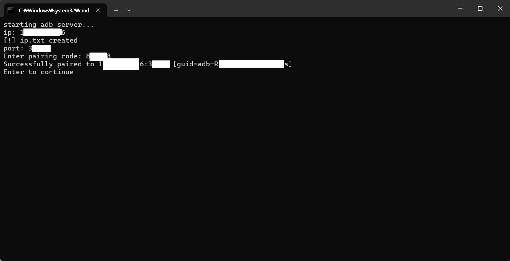
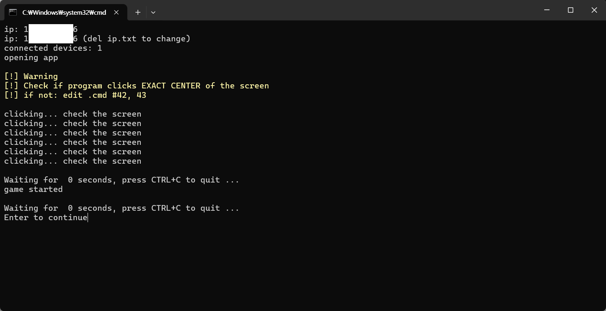
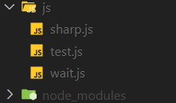
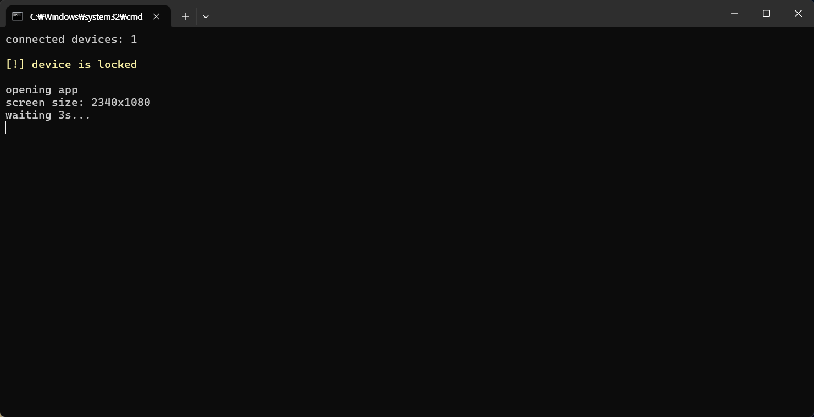
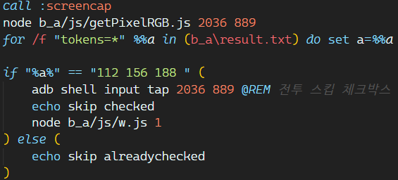
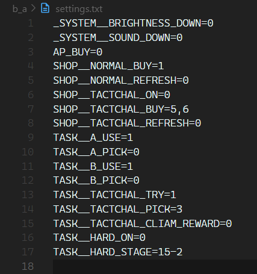

# Bluearchive Daily quest

일퀘해주는놈

adb & .bat 연습용

 

## 목차
 - [준비물](#준비물)
 - [사용법](#사용법)
 - [주의점](#주의점)
 - [기능](#기능)
 - [TODO](#todo)
 - [띵킹중인것들](#매우몹시생각고려중)
 - [개발일지](#개발일지)
 - [마지막](#last)

 

## 준비물

 - 이 프로그램 zip [(릴리즈 예정)](https://github.com/taeseong14/blue_dq/releases/latest)
   - 포함: js 폴더, node_modules 폴더(13개 하위 폴더), auto_dq.bat, init_device.bat, settings.txt
 - adb [(설치 링크)](https://developer.android.com/tools/releases/platform-tools?hl=ko)
 - node.js [(설치 링크)](https://nodejs.org/en/download/package-manager/current)

 

## 사용법

### [최초 사용]

> 설치

 - [준비물들](#준비물) 깔기
 - adb 폴더 안에 zip파일 압축해제 (`platform-tools > b_a > ~.bat` 파일이 있도록)

> 기기 페어링 (최초)

 - 핸드폰의 `개발자 옵션 > 무선 디버깅` 기능을 키고 `init_device.bat` 실행
 - 핸드폰에서 `페어링 코드로 기기 페어링` 버튼을 누르고 `IP 주소 및 포트` 부분에 나오는 `?.?.?.?:nnnnn` 부분에서 ?.?.?.?(ip)를 입력, nnnnn(port)를 입력 후 페어링 코드를 입력

> 사용자 맞춤

 - settings.txt 에서 사용자 맞춤 설정 가능.

<code>사용자 설정 가이드</code>

#### 기본 규칙
 - `=` 뒤에 값 넣으면 댐. 중괄호는 빼고. 중괄호 안 `:` 뒤 머시기들은 기본값.
   - ex) _SYSTEM__BRIGHTNESS_DOWN={n: 0} 에서는 n은 기본으로 0임. `_SYSTEM__BRIGHTNESS_DOWN=0` 이렇게. 이제 저 0 말고 원하는 숫자 넣으면 됨.

> _SYSTEM__BRIGHTNESS_DOWN={n: 0}
 - 프로그램 시작할때 폰 밝기 n번 낮춤. 새벽에 눈뽕 방지용

> _SYSTEM__SOUND_DOWN={n: 0}
 - 프로그램 시작할때 폰 소리 n번 낮춤.

> AP_BUY={n: 0}
 - ap 구매 횟수. 3충이면 3, 6충이면 6..
 - ex) `AP_BUY=3` -> 하루 3충 (90청휘석)

> SHOP__NORMAL_BUY={n..: 1}
 - 상점(일반)에서 구매하는 물품. 차례대로 1~24 중 원하는 숫자들 콤마로 구분해서 적으면 됨. 공백은 ㄴㄴ
 - ex) `SHOP__NORMAL_BUY=1,2,3,4,17,18,19,20,21,22,23,24` -> 보고서, 재료 모두 구매

> SHOP__NORMAL_REFRESH={n: 0}
 - 상점(일반) 즉시 갱신 횟수 (~3). 예시로 2라면 `SHOP__NORMAL_BUY`의 항목들 구매 -> 갱신 -> 구매 -> 갱신 -> 구매

> SHOP__TACTCHAL_ON={n: 0}
 - 상점(전술 대회)에서 물건 구매 여부. 
 - 1: 사기, 0: 사지 않기

> SHOP__TACTCHAL_BUY={n..: 5,6}
 - `SHOP__TACTCHAL_ON`이 1일때 상점(전술 대회)에서 살 물건들. 차례대로 원하는 품목 번호 콤마로 구분해서 적기 (공백은 ㄴㄴ). 기본으로 설정된 5,6은 ap 두개

> SHOP__TACTCHAL_REFRESH={n: 0}
 - `SHOP__TACTCHAL_ON`이 1일때 상점(전술 대회) 즉시 갱신 횟수 (~3).

> TASK__A_USE={n: 1}
 - 현상수배 돌리는지 여부.
 - 마지막 스테이지 (I)만 돌리므로, 모든 현상수배를 (I)스테이지까지 깨지 못했다면 꺼둬야 함.
 - 1: 현상수배 돌리기, 0: 현상수배 돌리지 않기

> TASK__A_PICK={n..: 0}
 - 현상수배 지역? 선택 (0~3).
 - 0(기본): 3개중 랜덤, 1: 고가도로, 2: 사막 기찻길, 3: 교실
 - ex) `TASK__A_PICK=3` -> 교실만 돌림
 - ex) `TASK__A_PICK=1,2` -> 교실 제외 둘중 랜덤

> TASK__B_USE={n: 1}
 - 학원교류회 돌리는지 여부.
 - 마찬가지로 스테이지 (D)만 돌리므로 머시깽이
 - 1: 켜기, 0: 끄기

> TASK__B_PICK={n..: 0}
 - 학원교류회 지역 선택 (0~3).
 - 0(기본): 3개중 랜덤, 1: 트리니티, 2: 게헨나, 3: 밀레니엄

> TASK__TACTCHAL_TRY={n: 1}
 - 전술대회 도전 횟수 (0~5).
 - 0 -> 자동 도전 안함, n(1~5) -> n번 츄라이

> TASK__TACTCHAL_PICK={n: 3}
 - 전술대회 도전 리스트에서 고르는 사람 (1~3)
 - 1로 두면 첫번째 사람(제일 등수 높은)한테 도전함

> TASK__TACTCHAL_CLIAM_REWARD={n: 0}
 - 도전 다 하고 보상 받는지 여부
 - 0(기본): 안받기, 1: 받기

> TASK__HARD_ON={n: 0}
 - 하드 임무 소탕하는지 여부
 - 1: `TASK__HARD_STAGE`의 스테이지 클리어, 0: 하드 임무 소탕 안함

> TASK__HARD_STAGE={a-b..: 15-2}
 - `TASK__HARD_ON`이 1일때 소탕하는 하드임무(들). n-n 형식으로 콤마로 구분해서 입력 (사이에 공백 ㄴㄴㄴㄴㄴ)
 - ex) `TASK__HARD_STAGE=1-1` : 1-1 스테이지 3번 소탕
 - ex) `TASK__HARD_STAGE=15-1,15-2,15-3` : 15-1,2,3 스테이지 각각 3번 소탕

더 많은 설정 기능 추가 예정.

### 그 후 사용

 - `auto_dq.bat` 실행

 

## 주의점

 - 이 프로그램은 안드로이드 14, 스크린 사이즈 1080x2340px, `adb v1.0.41`에서 작성되었고, 애초에 개인사용 + .bat 연습용으로 제작되었길래 뭔 일 생겨도 책임 못집니다..

#### 기능상

 - 현상수배의 경우 기본적으로 세 지역(고가도로, ..)중 랜덤의 I스테이지를 소탕하므로 주의 필요
 - 학원교류회의 경우도 마찬가지로 D스테이지만을 돌림. (-> 필자는 학원교류회 D스테를 깬 게한나로 고정)
 - 그 외에도 여러 커스텀 기능이 있으니 [사용자 설정 문서(?)](#settings-document)를 참고하시오.

#### 핸드폰 / 외부 문제

 - 딜레이 문제 (인터넷 성능 / 폰성능 등)로 인해 한번 터치를 안먹으면 뒤의 모든 스크립트가 꼬이므로 즉시 `Ctrl+C`로 정지하고 어디서 막혔는지 이슈로 남겨주셈.

 

## 기능

> 완성된 기능

테스트 끝난 기능들.

 - (1) 카페 ap 받기 ~~(ap 꽉차는걸 고려해야하나?)~~
 - (3) 서클 출석 (이미 돼있을경우 고려 v)
 - (4) 제조 수령, 1개? (빠른 제조 -> 설명서같은곳에 적어놔야)
 - (5) 상점 구매 (미션위해 회색보고서만, 꼬우면 커스텀 ㄱ)
 - (6) 현상수배 (3중랜덤?)

> 개발중인 기능

 - [ ] (2) 카페 학생 터치 (터치 아이콘이 움직여서 픽셀 rgb 유사도 비교해야할듯...)
 - [X] (7) 학원교류회 (3중랜덤) - 완성, 내가 게헨나 빼고 D스테를 안깨서 임시로 게헨나 고정
 - [X] ~~(8) 전술 대회 보상받기?~~ (<- 커스텀으로), 1회 돌기 (스킵 켜져있는지 확인 필요, sharp.js로)
 - [ ] (9) 미션 -> 모두 받기 (임무 x, 오전 -> 8개 [두번 받아야함])
 - [ ] (10) 우편 전부 받기 (ap 넘칠거 고려)
 - [ ] ~~(11) ap 어떤식이라도 소비하기~~ 생각고려중
 - [ ] (12) 설정 추가하기
   - [ ] 시스템 - 밝기 낮추기
   - [ ] 시스템 - 소리 낮추기
   - [ ] AP 구매
   - [ ] 상점 구매
   - [ ] 현상수배 온오프/픽
   - [ ] 학원교류회 온오프/픽
   - [ ] 전술대회 커스텀
   - [ ] 하드스테 소탕

 - [ ] (!) ap 받을때마다 넘치는거 생각고려

> 미지원/개발예정 기능

 - 사용자 맞춤 기능에 들어갈거
   - 상점 구매 항목 (일반 / 전술대회 상점)
   - 임무 (~~하드~~, 이벤?..)
   - 스케쥴 학생 선택

## TODO:
 - [X] adb 연결
    - [X] init_device - pair
    - [X] auto_dq - auto connect
    - [ ] 마지막에 disconnect?
 - [X] 앱 켜기
 - [X] 스크린 사이즈 들고오기
 - [X] 메인화면 들가기
 - [X] 출석보상, 메모리얼 스킵, 공지 x표, 공월/ap 수령, 아이템 만료 알림 치우기
 - [ ] [기능들](#기능)
    - [ ] 완성후 최종 딜레이(겜시작, 메인화면, 로딩) 조정
  

---
  

## 매우몹시생각고려중))

1. ~~전술대회....... 미션용 1회 입장만 하고 (sharp로 전투스킵 체크) 보상받는건 귀차니즘 모드에나 넣어야할듯 on-off를 넣던가~~ settings.txt 추가

3. ~~상점 구매같은거 효율 찾아봐야함. 지금은 임시로 보고서 하나(미션용)만 사게 할것.~~ 사용자 설정으로 바꿈

4. ms단위로 정지가 안먹음(ping, powershell command 등등). `./wait.js` 실행해서 100ms 멈추게 한게 유일한 방법.

5. ~~다른폰들 스크린사이즈 고려하기 귀찮으면 그냥 `adb shell wm size 1080x2340` 박아버리는게 나을수도?~~ 스샷 찍을때 이거 하고 찍고 리셋하기로 함

  

---

  

## 개발일지

> 2024-08-23

올해에는 개발 못끝낼게 예상됨..   
.bat 두개 추가

<code>더보기</code>

<ul>
<li>init_device.bat: 기기 최초 페어링</li>

<li>auto_dq.bat: 메인 인스턴스?</li>

</ul>

 - adb pair 완성 (init_device.bat)
 - 대충 adb 연결이랑 블아 실행 완성
 - ip.txt 추가, settings.txt같은거 추가예정 (key=val format) 아님 json이라던가?

 

> 2024-08-25

 - js 폴더 추가

<code>더보기</code>

 - sharp.js: 전술대회 스킵이 켜져있는가 확인용 (수정예정)
 - test.js: 카페에서 클릭해야 할 학생 위치 찾기용 (개발중)
 - ~~wait.js~~[->w.js]: 대충 ms단위 대기용

 

 - `wm size`로 스크린 wxh 들고게함

<code>더보기</code>

 

 - 스크린사이즈를 `adb shell wm size`로 직접 갖고오기로 햇음.
 - 화면 켜주는것도 추가(?). 사용자 맞춤 기능으로 넣을수도?

또 카페 학생 위치 파악 기능 개발중 [(test.js)](js/test.js)

 

> 2024-08-27

 - 어제 만든 기능들 테스트, 조율
 - 학원교류회 기능 추가, 아직 디버깅상태(안타깝게도.)

 

> 2024-08-28

 - 기능 타이밍 조정

 

> 2024-08-29

 - 기능 타이밍 추가 조정. 내일 테스트로는 다 되기를.. 윾

 

> 2024-08-30

 - 전술대회 파트 완성. 테스트는 내일 해봄

<code>더보기</code>

 - sharp로 이미지 데이터 갖고오는건 많이 쓸거같아서 js/getImageData.js로 분리 -> `require('./getImageData')`로 사용 가능
 - 대충 스샷 -> 전투스킵 체크박스 부분 rgb 갖고와서 회색(노체크)이면 클릭함.

 

 - settings.txt 추가

<code>더보기</code>

 - 벌써부터 정신이 아득해지네
 - [사용자 설정 문서](#settings-document)도 작성함.

  

---

  

블아뉴비+배치파일 연습용이라 먼가먼가 비효율적인것도 많을

기능 & 배치파일 개선점 있으면 좀 알려주쇼